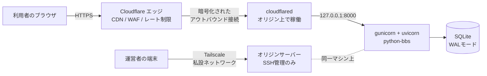

# python-bbs を秘匿サーバーとして本番運用する

小規模な匿名掲示板(`python-bbs`)を、レンタルサーバーではなく自分で用意したマシン(自宅サーバー・小型VPSなど)の上で、**オリジンのIPアドレスを公開せずに**運用するための手順です。

## これは何のための構成か

- **Cloudflare**: 掲示板の公開面(CDN・DDoS対策・WAF・レート制限)を受け持つ。利用者は Cloudflare 経由でしかアクセスできず、オリジンサーバーのIPアドレスは利用者にもボットにも見えない。
- **Tailscale**: 運営者自身の管理アクセス(SSHなど)を、公開インターネットに一切さらさずに行うための私設ネットワーク。

**この構成が守るもの**: オリジンサーバーへの直接攻撃(IPスキャン、直接DDoS、総当たりSSH)と、運営者の物理的な所在地が外部から特定されるリスクです。

**この構成が免除してくれないもの**: 違法なコンテンツの削除要請や、法律に基づく開示請求への対応義務です。Cloudflareも、自社の利用規約・各国の法令に基づく要請には応じます。「摘発を逃れる」ことを目的にした構成ではなく、*合法に運営する掲示板を、通常の脅威(DDoS・荒らし・スキャン)から守りながら、運営者の安全も確保する*ための構成です。このドキュメントの後半に、削除要請・開示請求に備えるための節を設けています。

## 全体構成



ポイントは、**オリジンサーバーに公開インターネットから到達できる経路が一つも無い**ことです。

- `cloudflared` は、Cloudflareのエッジへ**自分から発信**して接続を張ります。待ち受けポートを一切開ける必要がありません(80番・443番すら不要)。
- SSHは、Tailscaleのインターフェース経由でのみ許可します。
- アプリ本体(gunicorn)は `127.0.0.1` だけで待ち受けるため、同じマシンの `cloudflared` 以外からは接続できません。

## 参考: Tunnelを使わない「普通のプロキシ」構成との違い

Cloudflareには、Tunnelを使わなくても、オリジンのIPを一応隠す方法があります。昔からある、DNSのプロキシ機能(オレンジ雲)だけを使う構成です。なぜこのガイドがわざわざTunnelを使うのか、違いを理解しておくと判断しやすくなります。

### 仕組み

普通のプロキシ構成では、オリジンサーバーは従来どおりポート80/443を公開インターネットに向けて開けます。秘匿はDNSの応答だけで行います。

- ドメインのAレコードを「プロキシ済み(オレンジ雲)」にすると、利用者が名前解決したときに返るのは、あなたのサーバーの実IPではなく**Cloudflareのエニーキャストアドレス**です。
- 利用者はまずそのCloudflareのIPに接続し、Cloudflareが内部的に記録している(DNS上には出てこない)実IPへ転送します。

```
利用者 → (DNS解決) → Cloudflareの公開IP → Cloudflareのエッジ → (内部記録の実IPへ転送) → オリジン
```

つまり「IPが無くなる」のではなく「DNSで公開されなくなる」だけです。**オリジンの80/443は実際には開いたまま**で、実IPを知っている相手には直接到達できます。

### Tunnelとの決定的な違い

| | 普通のプロキシ(オレンジ雲のみ) | Cloudflare Tunnel(このガイドの構成) |
|---|---|---|
| オリジンの着信ポート | 80/443が開いている(知っていれば直接到達可能) | **何も開けない**(cloudflaredが発信するだけ) |
| 秘匿の性質 | 「知られなければ繋がらない」(DNS層の隠蔽) | 「知られても繋がらない」(そもそも玄関が無い) |
| 実IPが漏れた場合 | 直接アクセスされ、Cloudflareの保護を丸ごと迂回される | 実IPが分かっても、着信を受け付けないので意味を持たない |

### 実IPが漏れる代表的な経路(普通のプロキシ構成の場合)

- **過去のDNS履歴**: Cloudflare導入前や、一時的にプロキシをオフ(グレー雲)にしていた期間のAレコードが、履歴DNSデータベースに残り続けます。Cloudflare自身が「導入後はオリジンIPをローテーションすること」を公式に推奨しているのはこのためです。
- **同じサーバーを指す、プロキシされていない別のレコード**: メール(MXは通常プロキシ対象外)やFTP用サブドメインなどが同じIPを指していると、そちらに名前解決すれば実IPが出てきます。
- **直接IP接続での迂回**: 実IPさえ分かれば、多くのWebサーバーはHostヘッダーが何であろうと応答してしまうため、Cloudflareを素通りして直接アクセスされます。これを自動化する「CloudFlair」のようなツールも実在します。

### 普通のプロキシ構成を選ぶ場合の対策(参考)

Tunnelを使わずにこの構成を選ぶ場合、Cloudflare公式は次を推奨しています。

1. HTTP/HTTPSを扱うレコードを**すべて**プロキシする(同じサーバーを指す非プロキシのレコードを残さない)
2. Cloudflare導入後にオリジンのIPをローテーションする(過去の履歴に残ったIPを無効化するため)
3. ファイアウォールで、Cloudflareの公開IP帯(`https://www.cloudflare.com/ips/`)以外からの80/443番着信を拒否する
4. **Authenticated Origin Pulls(mTLS)** を有効にする。IPアドレスでの絞り込みより強く、Cloudflareだけが持つクライアント証明書を提示できない接続は、送信元IPに関わらずTLSハンドシェイクの段階で拒否される

### このガイドがTunnelを選ぶ理由

普通のプロキシ構成の対策(1〜4)は、どれも「オリジンに開いた玄関」を運営者自身が守り続けることが前提です。IP帯のリストは更新されるので追従が要りますし、設定ミスが一つあれば秘匿は崩れます。Tunnelは**そもそも玄関が存在しない**ので、この種の守り続ける手間そのものが要りません。小規模掲示板を一人〜少人数で長期運用するという前提に対しては、Tunnelの方が運用負荷が小さいと判断し、このガイドではTunnelを採用しています。

## 前提

- Ubuntu/Debian系の専用マシン(自宅サーバー、または小型VPS)
- Cloudflareアカウントと、管理しているドメイン
- Tailscaleアカウント

> ⚠️ `cloudflared` と `tailscale` 自体のインストールは、この教材の動作確認環境(ネットワーク制限のあるサンドボックス)からはダウンロードできず、実機での動作確認はできていません。コマンドは両サービスの公式ドキュメントに基づいていますが、実行前に公式サイトで最新の手順を確認してください。それ以外の部分(systemdユニット、SQLiteの並行性、レートリミッター、ファイアウォール設定の構文)は、このリポジトリの環境で実際に動かして確認しています。

---

## Step 1: 専用ユーザーとディレクトリの準備

アプリをrootで動かさないようにします。

```bash
sudo useradd --system --create-home --shell /usr/sbin/nologin bbs
sudo mkdir -p /opt/python-bbs/data /opt/python-bbs/backups
sudo chown -R bbs:bbs /opt/python-bbs
```

## Step 2: アプリの配置と本番用サーバーの用意

```bash
sudo -u bbs git clone <このリポジトリのURL> /opt/python-bbs
cd /opt/python-bbs
sudo -u bbs python3 -m venv venv
sudo -u bbs ./venv/bin/pip install -r requirements.txt
```

本番では `uvicorn --reload` ではなく、`gunicorn` でuvicornワーカーを複数束ねて動かします(`requirements.txt` に `gunicorn` を含めています)。

> 💡 **SQLiteと複数ワーカーについて**
> このアプリはもともと単一の共有接続でしたが、複数スレッド・複数プロセスから同時に使うと `sqlite3.InterfaceError` が不定期に発生することが、実際の負荷テストで確認できました(詳しくは `database.py` のコメントを参照)。そこで、**スレッドごとに別のSQLite接続を持つ**方式に直してあります。SQLiteのWALモードと組み合わせることで、複数ワーカー・複数スレッドからの同時読み書きでも壊れないことを、3ワーカー×150並行リクエスト×3回の負荷テストで確認済みです(エラー0件、欠落0件、重複0件)。

`/etc/python-bbs.env` を作成します(`deploy/systemd/python-bbs.env.example` を元に)。

```bash
sudo cp deploy/systemd/python-bbs.env.example /etc/python-bbs.env
sudo "$EDITOR" /etc/python-bbs.env
sudo chown root:bbs /etc/python-bbs.env
sudo chmod 640 /etc/python-bbs.env
```

## Step 3: systemdサービスとして常駐させる

```bash
sudo cp deploy/systemd/python-bbs.service /etc/systemd/system/
sudo systemctl daemon-reload
sudo systemctl enable --now python-bbs
sudo systemctl status python-bbs
curl -s -o /dev/null -w "%{http_code}\n" http://127.0.0.1:8000/   # 200 ならOK
```

ユニットファイルは `systemd-analyze verify` で構文検証済みです。`NoNewPrivileges` や `ProtectSystem=strict` などのサンドボックス指定で、アプリプロセスが自分のデータディレクトリ以外に書き込めないようにしています。

## Step 4: ファイアウォール — 公開ポートを一切開けない

```bash
# <tailscaleのインターフェース名> は、後述のStep 6でTailscaleを入れた後に確認する。
sudo bash deploy/scripts/firewall-ufw.sh <tailscaleのインターフェース名>
```

このスクリプトは、SSH(22番)を**Tailscaleのインターフェース経由だけ**に絞り、それ以外の着信をすべて拒否します。80番・443番ポートは開けません。これは手間を省くためではなく、「開けるポートが無い」こと自体が一番強いファイアウォールだからです。

## Step 5: Cloudflare Tunnel でオリジンIPを隠す

公式ドキュメント: https://developers.cloudflare.com/cloudflare-one/connections/connect-networks/

```bash
# cloudflaredのインストール(公式ドキュメントのパッケージを使用)
cloudflared tunnel login
cloudflared tunnel create python-bbs
# → /etc/cloudflared/<TUNNEL_UUID>.json に認証情報ファイルが作られる
```

`deploy/cloudflared/config.yml` の `<TUNNEL_UUID>` と `hostname` を実際の値に書き換え、`/etc/cloudflared/config.yml` に配置します(YAML構文は検証済みです)。

```bash
sudo cp deploy/cloudflared/config.yml /etc/cloudflared/config.yml
cloudflared tunnel route dns python-bbs bbs.example.com
sudo cloudflared service install
sudo systemctl enable --now cloudflared
```

Cloudflareダッシュボードで、DNSレコードが**プロキシ済み(オレンジ雲)**になっていることを確認してください。グレー雲(DNSのみ)だと、オリジンのIPが直接公開されてしまいます。

### Cloudflareダッシュボードで設定しておくこと

- **SSL/TLS**: 「フル(厳密)」(cloudflaredがTLSを扱うため、オリジン証明書は別途不要)
- **WAF**: マネージドルールを有効化
- **Bot Fight Mode**: 有効化(無料プランでも使えます)
- **レート制限ルール**: 例えば「同一IPから1分間に20件を超えるPOSTで一時ブロック」。これが**主たる**防御線です。アプリ側のレートリミッター(後述)は、あくまで二段目の保険です。
- **キャッシュルール**: `/static/*` をエッジでキャッシュし、オリジンの負荷を減らす

## Step 6: Tailscale — 管理アクセス専用の私設ネットワーク

公式ドキュメント: https://tailscale.com/kb/1017/install

```bash
curl -fsSL https://tailscale.com/install.sh | sh
sudo tailscale up --ssh --advertise-tags=tag:bbs-admin
```

`deploy/tailscale/acl.json.example`(厳密なJSONとして検証済み)を参考に、Tailscale管理画面のACLタブで、`tag:bbs-admin` を持つ端末だけがこのサーバーにSSHできるように制限します。

> ⚠️ **重要**: `tailscale serve` や `tailscale funnel` で掲示板そのものを公開しないでください。それをするとTailscale経由で掲示板が公開され、Cloudflareの保護(WAF・レート制限・オリジンIPの秘匿)を迂回してしまいます。Tailscaleは**運営者の管理アクセス専用**に留めます。

ファイアウォール設定(Step 4)は、ここで作られた `tailscale0` インターフェースを前提にしているので、Tailscaleを入れた後に実行するか、入れた後にインターフェース名を指定して再実行してください。

## Step 7: 動作確認

- `https://bbs.example.com/` が開けること
- `curl https://bbs.example.com/` の応答ヘッダーに `cf-ray` が含まれること(Cloudflareを経由している証拠)
- オリジンサーバーに80番・443番で直接到達できないこと(`nmap` などで自分のサーバーのグローバルIPを外部からスキャンして確認)
- 自分の端末から `tailscale ssh` でオリジンに入れること、Tailscaleを使わない通常のSSH(ポート22への直接接続)は拒否されること

## 多層のレート制限・荒らし対策

| 層 | 何を防ぐか | 設定場所 |
|---|---|---|
| Cloudflare WAF / Bot Fight Mode | 既知の攻撃パターン、簡易ボット | Cloudflareダッシュボード |
| Cloudflareレート制限ルール | 短時間の大量リクエスト全般 | Cloudflareダッシュボード(**主防御**) |
| アプリ内レートリミッター(`ratelimit.py`) | 上を抜けてきたものへの保険 | `main.py`(コード) |
| 入力長の上限(`Form(max_length=...)`) | 巨大な投稿によるDB肥大化 | `main.py`(既存) |

アプリ内レートリミッターは、`CF-Connecting-IP` ヘッダーから実IPを読み取ります。これは **cloudflared以外からオリジンに到達できない**(Step 4のファイアウォール)という前提があって初めて安全です。この前提が崩れる構成(アプリを直接公開する等)では、このヘッダーは誰でも偽装できるため使わないでください。

> ⚠️ **既知の制限**: アプリ内レートリミッターは、プロセスのメモリ上に状態を持ちます。`gunicorn --workers 2` のようにワーカーを複数にすると、ワーカーごとに別々のカウンターになるため、**実質的な上限はワーカー数倍になります**(例: 1ワーカーあたり毎分10件の設定で2ワーカーなら最大20件)。小規模掲示板で無料の保険として使う分には十分ですが、厳密な上限が必要なら、Cloudflare側のレート制限ルールを主軸にするか、Redisなど外部ストアに置き換えてください。

## 削除要請・開示請求への備え

匿名掲示板であっても、著作権侵害や違法コンテンツの通報・削除要請、捜査機関からの正当な開示請求に対応できる体制を整えておくことは、運営者の法的リスクを減らす上で重要です。

- 利用規約・連絡先ページを用意する(このリポジトリには未実装です)
- 通報を受けたら速やかに該当投稿を削除できる、運営者専用の削除手段を用意する(このリポジトリには未実装です。認証つきの管理画面を追加する場合は、CSRF対策とレート制限を忘れずに)
- Cloudflareのログ保持期間・開示ポリシーを把握しておく
- 児童の性的搾取に関わるコンテンツは、検知次第、各国の通報窓口(日本では一般社団法人セーファーインターネット協会など)に通報する体制を、運営開始前に決めておく

## バックアップ

```bash
sudo apt install sqlite3   # sqlite3 CLIが入っていなければ
sudo -u bbs crontab -e
# 毎日3時にバックアップ
# 0 3 * * * BBS_DB_PATH=/opt/python-bbs/data/bbs.db /opt/python-bbs/deploy/scripts/backup-db.sh
```

`deploy/scripts/backup-db.sh` は、SQLiteのオンラインバックアップAPI(`.backup`)を使います。`cp` でのファイルコピーは、WALモード中は不整合なコピーになり得るため使いません。バックアップは同一サーバー上の `backups/` に残るだけなので、災害対策としては、暗号化した上でオフサイト(別の場所)にも転送することを推奨します。

## 更新

```bash
sudo -u bbs bash /opt/python-bbs/deploy/scripts/deploy.sh
```

`git pull` → 依存パッケージ更新 → `systemctl restart` を行う最小限のスクリプトです。ダウンタイムが発生します。無停止更新が必要になったら、Cloudflare側で一時的に別オリジンへ向ける、ブルーグリーンデプロイにする、などを検討してください。

## 既知の制限

- 削除・モデレーション機能、管理画面、認証は実装していません。必要なら別途追加してください(追加する場合、認証つき画面にはCSRF対策を加えてください。現状のアプリは完全匿名でセッションを持たないため、CSRFの実害はほぼありませんが、認証を足した瞬間に話が変わります)。
- バックアップの暗号化・オフサイト転送は、このリポジトリには含まれていません(`backup-db.sh` の末尾にコメントで導線だけ用意しています)。
- `cloudflared` / `tailscale` 自体のインストールと動作は、この教材の環境では検証していません。
